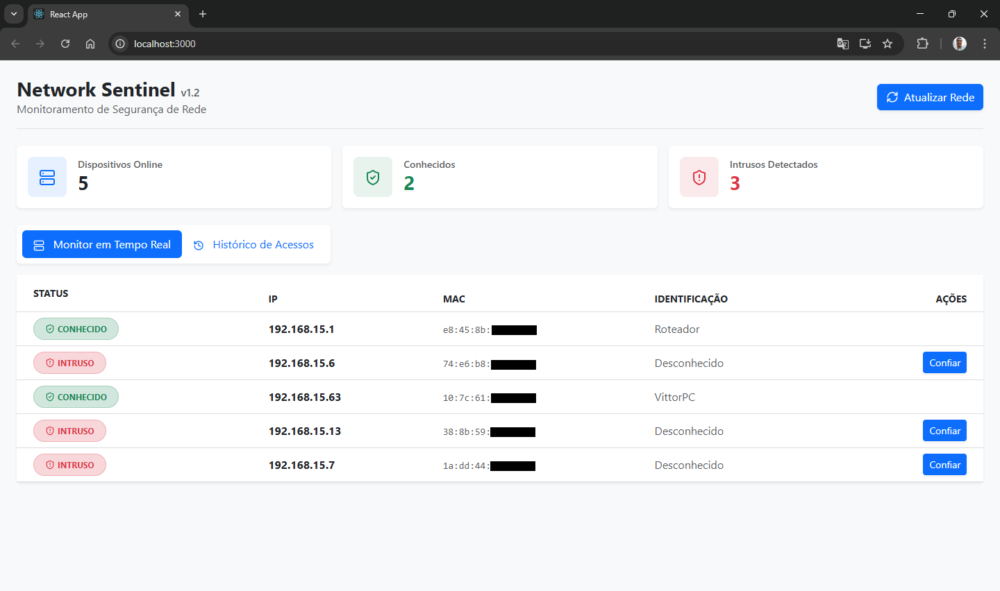
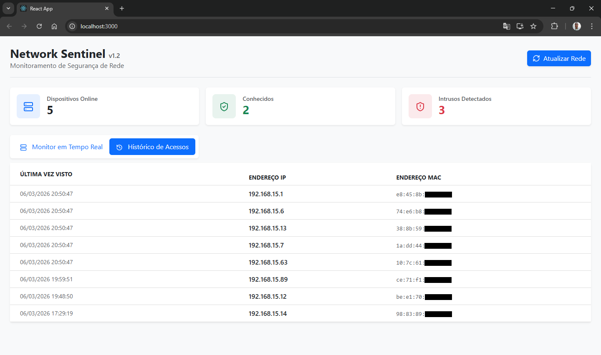

# 🛡️ Network Sentinel v1.2

O **Network Sentinel** é uma solução completa de monitoramento e segurança de rede. Ele combina o poder do escaneamento via protocolo ARP com uma interface moderna para identificar, gerenciar e registrar o histórico de todos os dispositivos conectados à sua rede local.


## 📸 Screenshots do Sistema

### Monitoramento em Tempo Real
Interface principal onde é possível visualizar dispositivos online e gerenciar a Whitelist.


### Histórico de Acessos
Registro inteligente de todos os dispositivos que já passaram pela rede, com data e hora local.


---

## 🚀 Evolução do Projeto

Este projeto nasceu como uma ferramenta simples de linha de comando e evoluiu para uma aplicação Full Stack robusta:

* **v1.0:** Script básico em Python para scan de rede via terminal utilizando Scapy.
* **v1.1:** Implementação de API com FastAPI e Banco de Dados SQLite3 para persistência de dados.
* **v1.2 (Atual):** * Interface Web moderna construída com React e Bootstrap 5.
    * Sistema de **Whitelist** para rotular dispositivos confiáveis.
    * **Histórico de Acessos** inteligente com tratamento de duplicatas (GROUP BY).
    * Dashboard com indicadores visuais e ícones intuitivos.

---

## ✨ Funcionalidades Principais

* **Monitoramento em Tempo Real:** Escaneamento ativo para identificar IP e MAC address de aparelhos online.
* **Dashboard Executivo:** Cards dinâmicos com contagem de dispositivos totais, conhecidos e potenciais intrusos.
* **Gestão de Whitelist:** Funcionalidade "Confiar" que permite batizar dispositivos (ex: "Meu Celular", "Smart TV Sala").
* **Histórico Inteligente:** Registro cronológico de acessos formatado no padrão PT-BR (DD/MM/AAAA HH:MM:SS).
* **UI/UX Profissional:** Navegação por abas e feedback visual de carregamento.

---

## 🏗️ Arquitetura Técnica

O projeto utiliza uma estrutura de software moderna e escalável:

* **Frontend:** React.js, Bootstrap 5, Lucide-React.
* **Backend:** Python 3, FastAPI, Uvicorn (ASGI).
* **Segurança/Rede:** Scapy (Manipulação de pacotes ARP).
* **Banco de Dados:** SQLite3 com integração nativa via Python.


---

## 🛠️ Como Instalar e Rodar

### Pré-requisitos
* Python 3.10+
* Node.js & NPM
* **Importante:** Permissões de Administrador/Root são necessárias para que o Scapy execute o scan ARP na interface de rede.

### Passo 1: Configurar o Backend
1.  Navegue até a pasta `backend`.
2.  Instale as dependências:
    ```bash
    pip install fastapi uvicorn scapy
    ```
3.  Inicialize as tabelas do banco de dados:
    ```bash
    python database.py
    ```
4.  Inicie o servidor:
    ```bash
    uvicorn main:app --reload
    ```

### Passo 2: Configurar o Frontend
1.  Navegue até a pasta `frontend`.
2.  Instale as dependências do React:
    ```bash
    npm install lucide-react bootstrap
    ```
3.  Inicie a aplicação:
    ```bash
    npm start
    ```

---

## 📝 Próximos Passos (Roadmap v1.3)
- [ ] **Auto-Scan:** Implementação de polling para atualização automática sem clique manual.
- [ ] **Vendor Lookup:** Identificação da fabricante do hardware via prefixo do MAC.
- [ ] **Notificações:** Alertas sonoros ou visuais ao detectar novos intrusos.

---
👤 Autor
João Vitor Santos Andrade - VittrAndrde
Estudante de Análise e Desenvolvimento de Sistemas.