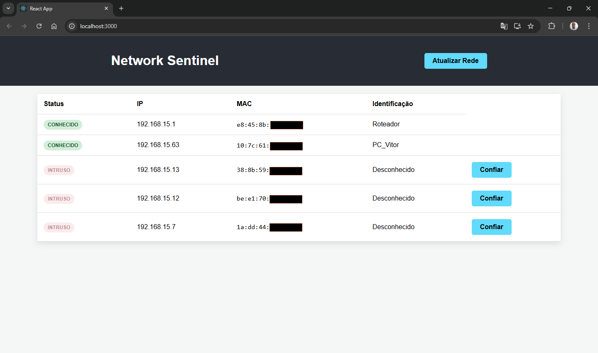

# 🛡️ Network Sentinel

O **Network Sentinel** é uma ferramenta de monitoramento de rede local desenvolvida para identificar dispositivos conectados em tempo real. O sistema utiliza varredura ARP para detectar endereços IP e MAC, permitindo classificar dispositivos como "Conhecidos" ou "Intrusos" através de uma interface web moderna.


## 🚀 Tecnologias Utilizadas

### Backend
* **Python 3.14+**: Linguagem principal.
* **FastAPI**: Framework web de alta performance para a API.
* **Scapy**: Biblioteca para manipulação de pacotes de rede (Scanner ARP).
* **SQLite**: Banco de dados leve para persistência da Whitelist e Histórico.
* **Uvicorn**: Servidor ASGI para rodar a aplicação.

### Frontend
* **React.js**: Biblioteca para construção da interface do usuário.
* **CSS3**: Estilização personalizada com foco em legibilidade e alertas visuais.
* **Hooks (useState, useEffect)**: Gerenciamento de estado e ciclo de vida.

---

## 🛠️ Funcionalidades

- **Scanner de Rede Real-time**: Varredura de IPs na faixa configurada (ex: `192.168.15.1/24`).
- **Identificação de MAC Address**: Captura o endereço físico real dos dispositivos.
- **Whitelist Personalizada**: Possibilidade de "Confiar" em dispositivos, atribuindo nomes (ex: "Meu Celular", "Roteador").
- **Alertas de Intrusão**: Dispositivos desconhecidos são destacados visualmente como **INTRUSOS**.
- **Histórico Automático**: Cada varredura é registrada no banco de dados para auditoria futura.

---

## 📸 Demonstração do Sistema


*Visualização de dispositivos intrusos e conhecidos na rede local.*

---

## 📋 Pré-requisitos

Antes de rodar o projeto, você precisará instalar o [Npcap](https://npcap.com/#download) (para Windows), necessário para que o Scapy capture pacotes de rede.

---

## ⚙️ Como Rodar o Projeto

### 1. Backend
```bash
cd backend
# Ative seu ambiente virtual (venv)
# No Windows:
..\venv\Scripts\activate
# Instale as dependências:
pip install fastapi uvicorn scapy
# Rode o servidor como ADMINISTRADOR:
uvicorn main:app --reload
```
### 2. Frontend 
```bash
cd frontend
npm install
npm start
```
📐 Arquitetura do Sistema

1. O projeto segue o modelo cliente-servidor:
2. O Frontend (React) solicita uma atualização.
3. O Backend (FastAPI) dispara o Scanner (Scapy).
4. O Scanner envia pacotes ARP Broadcast e recebe as respostas dos dispositivos ativos.
5. O Backend cruza os dados com o SQLite, define o status e retorna um JSON para o Frontend.

👤 Autor
João Vitor Santos Andrade - VittrAndrde
Estudante de Análise e Desenvolvimento de Sistemas.